<div align="center">




<br/>


</div>

---

## `$ cat about.yaml`

```yaml
name:       Prakshal Doshi
role:       Site Reliability Engineer
company:    Apple
location:   United States

team_size:  11 SREs (global team lead)
workload:   20,000+ TPS across AppleCare + new product launches

focus:
  - LLM inference infrastructure & AI-powered agents (MCP)
  - Multi-region active-active deployments
  - ChatOps-based deployments (Slack + Ansible + AWS)
  - Cloud cost optimization & failover validation
  - GenAI initiatives across SRE

philosophy: "toil is a bug · automate or die"

education:
  degree:   MS Computer Science
  school:   San Diego State University
  gpa:      3.71 / 4.0
  year:     2023
```

---

## `$ cat slo-dashboard.json`

<div align="center">

| metric | value | impact |
|--------|-------|--------|
| 🟢 system availability | **99.97%** | AppleCare + product launches |
| ⚡ peak throughput | **20,000+ TPS** | Apple Cloud + AWS |
| 🔥 cert-related incidents | **↓ 95%** | automated renewals + alerting |
| 🚀 release rollout time | **↓ 30%** | ChatOps deployments |
| 📦 service interruptions | **↓ 25%** | zero-downtime K8s migration |
| 💸 infra cost reduction | **↓ 55%** | monolith → microservices (JPMC) |
| ⏱ deployment time (JPMC) | **3 hrs → 20 min** | parallel CI/CD pipelines |
| ⏱ deployment time (ADP) | **55 min → 18 min** | Jenkins + CloudFormation |
| 👥 team led | **11 SREs** | global, Apple |

</div>

---

## `$ kubectl get stack --all-namespaces`

**Cloud & Orchestration**


**Infrastructure as Code**


**CI/CD**


**Observability**


**Languages**


**GenAI & MCP**


---

## `$ ls -la ./highlights`

### 🤖 LLM Inference & AI-Powered Incident Triage — Apple
> Architected LLM inference infra and MCP-integrated AI agents to automate incident triage across Splunk, Grafana, Kubernetes, and Ansible

```bash
$ agent --trigger incident --sources splunk,grafana,k8s,ansible
# → root cause identified · runbook generated · MTTR ↓ significantly
# → part of company-wide GenAI SRE initiative
```


---

### ⚙ ChatOps Deployments — Apple
> Designed Slack + Ansible + AWS pipeline deployments — rollout time **↓ 30%**, full release visibility

```bash
$ slack trigger deploy --env prod --app applecare
# → pipeline triggered · approvals collected · rollout complete
# → 30% faster than previous release process
```


---

### ◈ Petabyte-Scale K8s Migration — Apple
> Led end-to-end migration of petabyte-scale customer feedback service to Kubernetes — **↓ 25% service interruptions**

```bash
$ kubectl apply -f customer-feedback-migration.yaml
# → namespace relocated · GSLB/DNS configured
# → zero downtime · 25% fewer service interruptions
```


---

### ◉ Microservices Migration — J.P. Morgan Chase
> Monolith → microservices on Kubernetes — **↓ 55% operational cost**, **3 hrs → 20 min deployments**, **25 → 0 outages/month**

```bash
$ jenkins run pipeline --parallel --env prod
# → 9 services deployed in parallel · 0 downtime · cost ↓ 55%
# → P0/P1 incidents: authored RCA · presented to executives
```


---

## `$ tail -f /var/log/github-stats.log`

<div align="center">


</div>

---

## `$ cat certifications.txt`


---

## `$ cat /etc/motd`

```
╔──────────────────────────────────────────────────────────────────╗
│                                                                  │
│   🏆 "Best Infrastructure" — Google Cloud                       │
│      highly secure, highly available large-scale infra           │
│                                                                  │
│   ⭐ "Star Performer of the Month" — Quantiphi Analytics        │
│      leading and delivering a cost-efficient project             │
│                                                                  │
│   → automate the toil        → instrument everything             │
│   → write the runbook first  → blameless post-mortems, always   │
│                                                                  │
╚──────────────────────────────────────────────────────────────────╝
```

---

## `$ ping connect`

<div align="center">

[](https://linkedin.com/in/yourusername)
[](mailto:you@email.com)
[](https://yourresume.dev)

*open to SRE · platform engineering · infrastructure · DevOps · GenAI infra roles*


</div>

[](https://github.com/yourusername)
